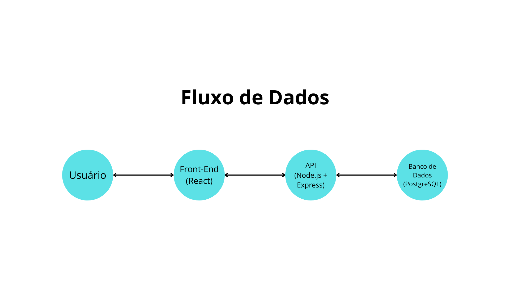

# 📌 API de Gerenciamento de Tarefas

Esta API permite o gerenciamento de tarefas, incluindo criação, edição, exclusão e listagem. Além disso, a API suporta autenticação JWT para garantir que cada usuário tenha acesso apenas às suas próprias tarefas.

## 🛠 Tecnologias Utilizadas

- **Node.js** + **Express** → Backend e rotas.
- **PostgreSQL** + **Sequelize** → Banco de dados e ORM.
- **JWT (JSON Web Token)** → Autenticação de usuários.
- **Swagger** → Documentação da API.
- **Jest + Supertest** → Testes automatizados.

---

### 📂 Estrutura de Diretórios
A estrutura de diretórios do frontend é organizada da seguinte forma:

```
backend/
├── controllers/          # Controladores da aplicação
│   ├── auth.controller.js       # Lida com autenticação de usuários
│   └── tarefa.controller.js     # Gerencia as tarefas
├── models/               # Modelos do banco de dados (Sequelize)
│   ├── tarefa.model.js         # Modelo da tabela de tarefas
│   └── usuario.model.js        # Modelo da tabela de usuários
├── routes/               # Definição de rotas da API
│   ├── auth.routes.js         # Rotas de autenticação
│   └── tarefa.routes.js       # Rotas de tarefas
├── middleware/           # Middlewares para a aplicação
│   └── auth.js                 # Middleware para autenticação JWT
├── config/               # Configuração do banco de dados e outros serviços
│   ├── database.js            # Configuração do banco de dados PostgreSQL
│   └── swagger.js             # Configuração do Swagger para documentação da API
├── tests/                # Testes automatizados
│   └── tarefa.test.js         # Testes para tarefas 
├── app.js                # Arquivo principal da aplicação (configuração do Express)
├── index.js              # Ponto de entrada do backend
├── .env                  # Configurações de ambiente (porta, banco de dados, JWT)
└── package.json          # Dependências e scripts do projeto

```

---

## ⚙️ **Como Configurar e Rodar o Projeto**

### 🔹 **1. Clonar o Repositório**
```sh
git clone https://github.comLuisFurmiga/mosaicq_todolist.git
cd mosaicq_todolist/backend
```

### 🔹 **2. Instalar Dependências**
```sh
npm install
```

### 🔹 **3 Configurar Banco de Dados PostgreSQL**

Antes de prosseguir, é necessário configurar o banco de dados PostgreSQL. Siga os passos abaixo:

1. Abra o terminal e conecte-se ao PostgreSQL como superusuário (postgres):
   ```sh
   psql -U postgres
   ```

2. **Criar um novo usuário e banco de dados**  
   Substitua `<BD_ADM_USER>` pelo nome do usuário que administrará o banco e `<BD_ADM_USER_PASSWORD>` pela senha desejada:
   ```sql
   CREATE USER <BD_ADM_USER> WITH ENCRYPTED PASSWORD '<BD_ADM_USER_PASSWORD>';
   CREATE DATABASE mosaicq_todolist OWNER <BD_ADM_USER>;
   ALTER DATABASE mosaicq_todolist OWNER TO <BD_ADM_USER>;
   GRANT ALL PRIVILEGES ON DATABASE mosaicq_todolist TO <BD_ADM_USER>;
   GRANT ALL ON ALL TABLES IN SCHEMA public TO <BD_ADM_USER>;
   GRANT ALL ON ALL SEQUENCES IN SCHEMA public TO <BD_ADM_USER>;
   ALTER ROLE <BD_ADM_USER> CREATEDB;
   ```

3. **Sair do PostgreSQL**
   ```sh
   \q
   ```

4. **Importar o script SQL para criar as tabelas**  
   Agora, conecte-se com o novo usuário e importe o banco de dados.  
   Substitua `<CAMINHO_PARA_ARQUIVO>` pelo caminho correto do arquivo `bd_mosaicq_todolist.sql`:
   ```sh
   psql -U <BD_ADM_USER> -d mosaicq_todolist -f <CAMINHO_PARA_ARQUIVO>/bd_mosaicq_todolist.sql
   ```

5. **Acessar o banco recém-criado**
   ```sh
   \c mosaicq_todolist;
   ```

Após essa configuração, o banco de dados estará pronto para ser utilizado pela aplicação. 🚀


### 🔹 **4. Configurar Variáveis de Ambiente**
Crie um arquivo `.env` na raiz do projeto e adicione:
```env
PORT=3000
DB_NAME=mosaicq_todolist
DB_USER=<DB_USER_ADM>
DB_PASS=<DB_USER_ADM_PASSWORD>
DB_HOST=localhost
DB_PORT=5432
JWT_SECRET=<GERE_COM_O_COMANDO_ABAIXO>
JWT_EXPIRATION=1h
```
> 💡 **Nota 00:** Substitua `<DB_USER_ADM>`, pelo usuário criado no passo anterior, e `<DB_USER_ADM_PASSWORD>`, pela senha do usuário.
> 💡 **Nota 01:** Para gerar um JWT_SECRET seguro, use:
```sh
node -e "console.log(require('crypto').randomBytes(64).toString('hex'))"
```

### 🔹 **5. Rodar a Aplicação**
- Em **modo de desenvolvimento** (com nodemon):
```sh
npm run dev
```
- Em **modo de produção**:
```sh
npm start
```

---

## 📝 **Endpoints da API**
### 🔒 **Autenticação**
- `POST /auth/login` → Autentica o usuário e retorna um token JWT.
- `POST /auth/register` → Cria um novo usuário.

### 📝 **Tarefas**
- `GET /tarefas` → Retorna todas as tarefas do usuário autenticado.
- `POST /tarefas` → Cria uma nova tarefa.
- `PUT /tarefas/{id}` → Atualiza uma tarefa específica.
- `DELETE /tarefas/{id}` → Exclui uma tarefa.

> 💡 **Todas as rotas de tarefas exigem um token JWT no header `Authorization: Bearer {token}`**.

---

## 🧪 **Rodando os Testes**
Para executar os testes automatizados com Jest:
```sh
npm test
```

---

## 🛠 **Diagrama de Arquitetura**
📀
{width=600}

---

## 🖥️ Frontend - Aplicação Web

A aplicação frontend foi desenvolvida utilizando **React.js** e tem como objetivo fornecer uma interface intuitiva para gerenciar tarefas de forma eficiente. A aplicação se conecta à API backend para permitir autenticação, criação, edição, exclusão e listagem de tarefas.

### 🚀 Tecnologias Utilizadas
- **React.js** → Framework principal para a interface do usuário.
- **React Router DOM** → Gerenciamento de rotas e navegação.
- **Material UI** → Componentes estilizados para uma melhor experiência do usuário.
- **Formik & Yup** → Gerenciamento de formulários e validação.
- **React Hook Form** → Alternativa para controle de formulários de forma otimizada.
- **Axios** → Cliente HTTP para comunicação com a API backend.
- **JWT Decode** → Decodificação e gerenciamento de tokens de autenticação.
- **ESLint & Prettier** → Padronização e formatação do código.

### 📂 Estrutura de Diretórios
A estrutura de diretórios do frontend é organizada da seguinte forma:

```
frontend/
├── public/                # Arquivos públicos (index.html)
├── src/
│   ├── components/        # Componentes reutilizáveis (modais, cabeçalhos, cartões, etc.)
│   ├── context/           # Context API para autenticação e tarefas
│   ├── pages/             # Páginas principais da aplicação (Login, Dashboard, Home, etc.)
│   ├── services/          # Serviços para conexão com API (authService, taskService, api)
│   ├── App.js             # Componente principal da aplicação
│   └── index.js           # Ponto de entrada da aplicação React
├── .env                   # Configuração de variáveis de ambiente (porta e API backend)
└── package.json           # Dependências e scripts do projeto
```

### 🔧 Configuração e Execução
1. **Instalar dependências**
   ```sh
   npm install
   ```
2. **Configurar variáveis de ambiente**
   No arquivo `.env`, definir a URL da API backend:
   ```sh
   PORT=3001
   REACT_APP_BACKEND_API_URL=http://localhost:3000
   ```
3. **Executar a aplicação**
   ```sh
   npm start
   ```

### 🔐 Rotas e Proteção de Páginas
- O sistema usa **React Router** para navegação entre páginas.
- As rotas protegidas utilizam um contexto de autenticação (`AuthContext`) para restringir o acesso a páginas específicas.

### 📌 Funcionalidades Principais
✔️ Registro e login de usuários (com JWT)  
✔️ Gerenciamento de tarefas (criar, editar, excluir, listar)  
✔️ Interface responsiva e moderna  
✔️ Modal para edição e adição de tarefas  
✔️ Persistência de autenticação  
✔️ Validação de formulários  

---

A aplicação frontend foi desenvolvida para fornecer uma experiência intuitiva e eficiente no gerenciamento de tarefas, integrando-se diretamente ao backend via API REST.

